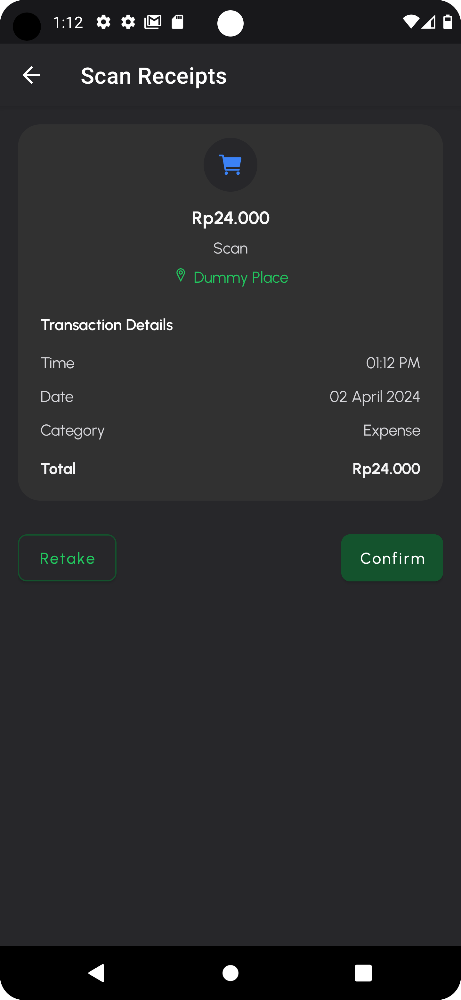
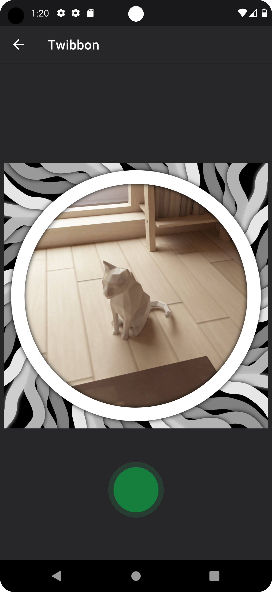

# Tugas Besar Android IF3210 Pengembangan Aplikasi Berbasis Platform

## Table of Contents

1. [About Bondoman](#about-bondoman)
2. [Libraries](#libraries)
3. [Screenshots](#screenshots)
4. [OWASP](#owasp)
5. [Accessibility Testing](#accessibility-testing)
6. [Credits](#credits)

## About Bondoman

Bondoman is a user-friendly money management app designed specifically for Android devices. Bondoman helps you take control of your finances effortlessly by providing essential tools to manage your transactions efficiently.

Bondoman is compatible with Android devices running on API 29 (Android 10) up to API 34 (Android 14)

<b>Bondoman Features:</b>

1. <b>Login</b>: Securely log in to your Bondoman account to access all features.
2. <b>Home Dashboard</b>: Get a comprehensive overview of your finances at a glance, including your budget summaries and recent transactions.
3. <b>Transaction List</b>: View list of your transactions, categorized by date.
4. <b>Add and Edit Transactions</b>: Easily add new transactions and edit existing ones.
5. <b>Scan Receipts</b>: Capture receipts directly from your device's camera or select from gallery to add new transaction.
6. <b>Save Transaction List to Excel</b>: Export your transaction data to Excel format for further analysis or record-keeping.
7. <b>Send Transaction List File to Email</b>: Share your transaction files via email with ease, allowing for seamless collaboration or backup.
8. <b>Twibbon Integration</b>: Add a personal touch to your transactions by overlaying Twibbon frames, making them more visually appealing and shareable on social media.
9. <b>Randomize Transaction</b>: Adding new transaction by randomization.

## Libraries

1. Retrofit
2. Room
3. [PhilJay MPAndroid Chart](https://github.com/PhilJay/MPAndroidChart)

## Screenshots

    
    
    
    
    
    
    
    
    
    
    
    
    
    
    
    
    
    
    
    

## OWASP

### M4: Insufficient Input/Output Validation

### M8: Security Misconfiguration

### M9: Insecure Data Storage

## Accessibility Testing

Notes: Suggestions have been fixed and can be seen on [screenshot section](#screenshots) 
Other suggestions contain suggestions that can not be fixed, such as suggestions for Google plugins and navigation bar 

    
    
    
    
    
    
    

## Credits

| NIM      | Full Name                 | Responsibilities | Working Hours |
| -------- | ------------------------- | ---------------- | ------------- |
| 13521059 | Arleen Chrysantha Gunardi | ...              | ...           |
| 13521124 | Michael Jonathan Halim    | ...              | ...           |
| 13521142 | Enrique Alifio Ditya      | ...              | ...           |
